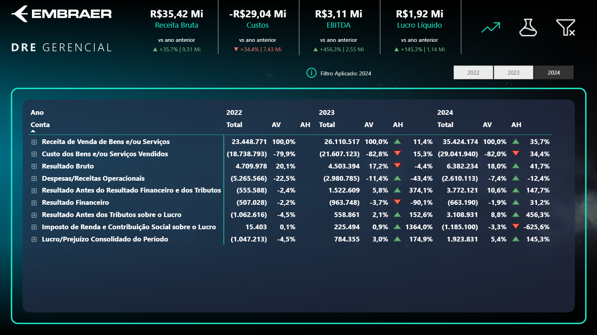
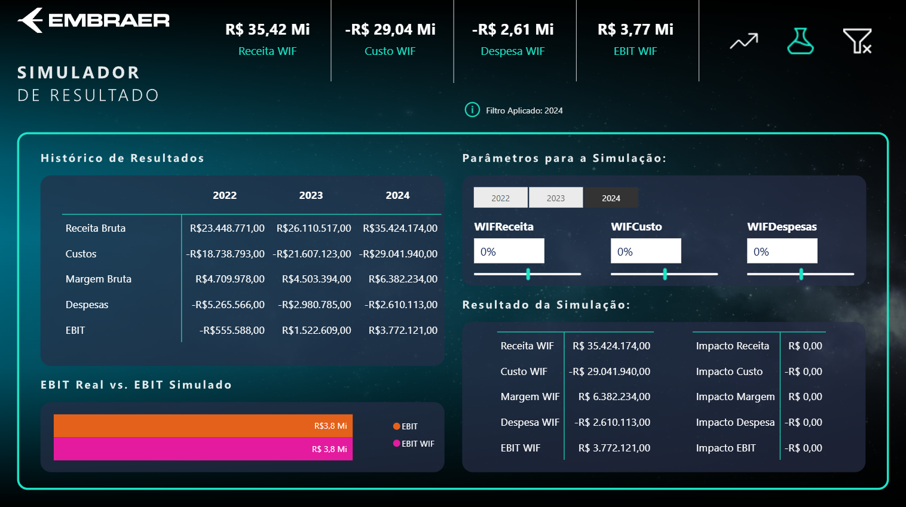

# 📊 DRE Automatizada – Análise Financeira

## 🧠 Sobre o Projeto

Desenvolvi um projeto de Business Intelligence focado na construção de uma DRE automatizada em Power BI, com o objetivo de transformar dados financeiros em suporte real à tomada de decisão.

O projeto substitui processos manuais baseados em planilhas por um modelo estruturado, permitindo análises dinâmicas, rastreabilidade dos dados e maior confiabilidade das informações.

Com o uso de Power Query, modelagem dimensional e DAX, foram construídos indicadores como Receita, Custos, EBITDA e Lucro Líquido, além de análises de variação (YoY, AH e AV) e simulações de cenários (What-If) para apoio estratégico.

---

## 🎯 Valor para o Negócio

O dashboard permite:

* Identificar tendências de desempenho financeiro
* Analisar a estrutura de custos e rentabilidade
* Avaliar impactos de decisões antes da execução
* Apoiar a priorização de iniciativas com maior geração de valor

---

## 🏗️ Arquitetura da Solução

Modelo dimensional (Star Schema):

* Fato: `ftResultado`
* Dimensões: `dPlanoConta`, `dCalendario`

---

## 🔄 Pipeline de Dados

1. Ingestão de dados (PDF e Excel)
2. Transformações no Power Query
3. Modelagem dimensional
4. Criação de métricas em DAX

---

## 🧾 Scripts e Rastreabilidade

Os scripts utilizados no projeto estão organizados nas seguintes pastas:

* `/scripts/powerquery` → Transformações de dados
* `/scripts/dax` → Métricas e indicadores

A solução foi documentada de forma a permitir rastreabilidade completa entre:

- Documentação técnica (/docs)
- Scripts (/scripts)
- Implementação no Power BI

Cada script contém referências diretas às seções da documentação, facilitando a validação técnica da solução.

---

## 📊 KPIs

* Receita Bruta
* Custos
* Despesas
* EBITDA
* EBIT
* Lucro Líquido

---

## 🔮 Simulação de Cenários

Análises What-If permitem avaliar impactos no resultado com base em variações de:

* Receita
* Custos
* Despesas

---

## 📸 Dashboard

---

## 💡 Conclusão

Este projeto reforça como Business Intelligence pode ir além da visualização, atuando como ferramenta de gestão, estratégia e governança de dados.
