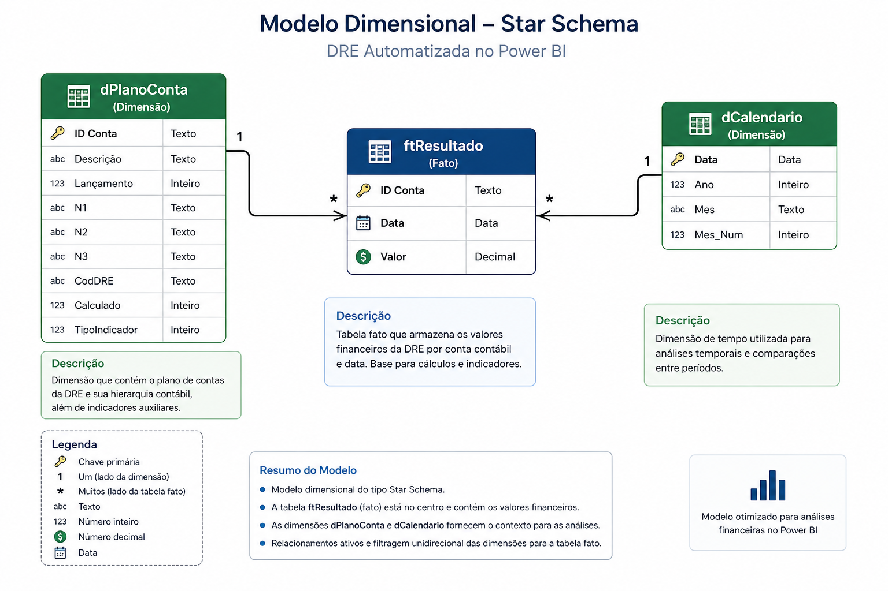

# 5. Dicionário de Dados

> Este dicionário descreve as tabelas utilizadas no modelo dimensional da DRE, preparadas para consumo analítico no Power BI.

---

## 📊 dPlanoConta

Dimensão responsável pela estrutura hierárquica da DRE e classificação das contas contábeis.

| Coluna           | Tipo     | Descrição                                           | Relacionamentos                     |
|------------------|----------|-----------------------------------------------------|------------------------------------|
| `ID Conta`       | Texto    | Identificador único da conta contábil               | 1:N → `ftResultado[ID Conta]`      |
| `Descrição`      | Texto    | Nome da conta                                       | -                                  |
| `Lançamento`     | Inteiro  | 1 = analítica / 0 = sintética                       | -                                  |
| `N1`             | Texto    | Grupo principal da DRE                              | -                                  |
| `N2`             | Texto    | Subgrupo contábil                                   | -                                  |
| `N3`             | Texto    | Conta analítica                                     | -                                  |
| `CodDRE`         | Texto    | Código principal da estrutura da DRE                | -                                  |
| `Calculado`      | Inteiro  | Controle auxiliar de agregações                     | -                                  |
| `TipoIndicador`  | Inteiro  | Receita (+1) / Custos e Despesas (-1)               | -                                  |

🔗 Script relacionado:  
👉 [03_dim_plano_conta.md](../scripts/powerquery/03_dim_plano_conta.md)

---

## 📈 ftResultado

Tabela fato responsável por armazenar os valores financeiros da DRE por conta e período.

| Coluna        | Tipo     | Descrição                             | Relacionamentos                   |
|--------------|----------|---------------------------------------|----------------------------------|
| `ID Conta`   | Texto    | Conta contábil associada ao valor     | N:1 → `dPlanoConta[ID Conta]`    |
| `Data`       | Data     | Data de referência financeira         | N:1 → `dCalendario[Data]`        |
| `Valor`      | Decimal  | Valor financeiro da DRE               | -                                |

🔗 Script relacionado:  
👉 [04_ft_resultado.md](../scripts/powerquery/04_ft_resultado.md)

---

## 📅 dCalendario

Dimensão de tempo utilizada para análises temporais e inteligência de datas.

| Coluna      | Tipo     | Descrição                              | Relacionamentos                |
|-------------|----------|----------------------------------------|-------------------------------|
| `Data`      | Data     | Data completa                          | 1:N → `ftResultado[Data]`     |
| `Ano`       | Inteiro  | Ano da data                            | -                             |
| `Mes`       | Texto    | Nome abreviado do mês                  | -                             |
| `Mes_Num`   | Inteiro  | Número do mês para ordenação           | -                             |

🔗 Script relacionado:  
👉 [05_dim_calendario.md](../scripts/powerquery/05_dim_calendario.md)

---

## ⭐ Estrutura do Modelo

Modelo dimensional seguindo o padrão Star Schema:

`dPlanoConta (1) → (N) ftResultado`  
`dCalendario (1) → (N) ftResultado`

📷 

---

## 🔗 Rastreabilidade

A estrutura do modelo está conectada diretamente aos scripts de transformação e à documentação técnica do projeto, garantindo:

- Clareza da modelagem
- Facilidade de manutenção
- Governança dos dados
- Consistência entre regra de negócio e implementação