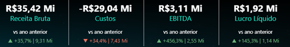

# 7. Métricas e Indicadores (DAX)

## 🎯 Objetivo

Estruturar métricas financeiras e análises dinâmicas para apoiar a interpretação da DRE, permitindo comparações históricas, análises de rentabilidade e simulações de cenários.

As medidas foram desenvolvidas em DAX utilizando a modelagem dimensional do projeto.

---

## 📊 Indicadores Financeiros

Principais KPIs implementados:

- Receita Bruta
- Custos
- Despesas
- Margem Bruta
- EBIT
- EBITDA
- Lucro Líquido

---

## 📈 Análises Financeiras

O modelo suporta análises comparativas e gerenciais, incluindo:

- YoY (Year over Year)
- AH (Análise Horizontal)
- AV (Análise Vertical)
- Variações absolutas e percentuais
- Comparações entre exercícios

Essas análises permitem identificar tendências, desvios e evolução da performance financeira.

---

## 🔮 Simulações (What-If)

Foram implementados cenários de simulação para avaliar impactos financeiros em:

- Receita
- Custos
- Despesas
- Margem
- EBIT

O objetivo é apoiar análises de sensibilidade e tomada de decisão baseada em cenários.

---

## ⚙️ Medidas Auxiliares

Além dos KPIs principais, o projeto inclui medidas auxiliares para:

- Formatação executiva
- Direção de indicadores
- Exibição contextual de filtros
- Conversão de valores para leitura gerencial

---

## 💻 Implementação Técnica

As medidas DAX foram organizadas por responsabilidade:

- [01_base.md](../scripts/dax/01_base.md)
- [02_kpis.md](../scripts/dax/02_kpis.md)
- [03_analises.md](../scripts/dax/03_analises.md)
- [04_yoy_valor.md](../scripts/dax/04_yoy_valor.md)
- [05_yoy_percentual.md](../scripts/dax/05_yoy_percentual.md)
- [06_simulacoes.md](../scripts/dax/06_simulacoes.md)
- [07_auxiliares.md](../scripts/dax/07_auxiliares.md)

📄 Ver visão completa:
👉 [Explorar documentação DAX](../scripts/dax/README.md)

---

## 📷 Indicadores no Dashboard

---

## 🔗 Rastreabilidade

As métricas estão conectadas diretamente a:

- Modelagem dimensional
- Estrutura da DRE
- Regras contábeis
- Scripts DAX

Fluxo completo:

`Fonte de Dados → Transformação → Modelagem → Métricas → Dashboard`