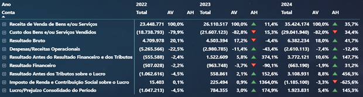
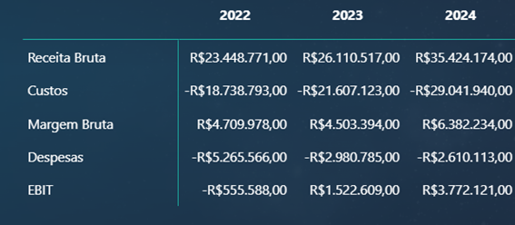
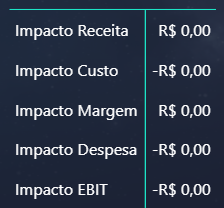

# 8. Visualizações Analíticas

## 📊 Cartões Executivos

Visual responsável por apresentar os principais indicadores financeiros da DRE de forma consolidada:

- Receita Bruta  
- Custos  
- EBITDA  
- Lucro Líquido  
- Variações YoY  

Objetivos:

- Monitorar desempenho financeiro
- Identificar tendências de crescimento
- Avaliar evolução da rentabilidade
- Apoiar decisões executivas

📷 

---

## 📑 DRE Analítica

Visual estruturado por hierarquia contábil (`N1`, `N2` e `N3`), permitindo análise detalhada da Demonstração do Resultado.

Análises disponíveis:

- Valores absolutos
- Análise Vertical (AV)
- Análise Horizontal (AH)
- Comparação entre exercícios

Objetivos:

- Avaliar composição do resultado
- Identificar pressão de custos e despesas
- Analisar evolução da margem operacional

📷 

---

## 🧪 Simulações What-If

Painel de cenários para projeção de impactos financeiros sobre:

- Receita
- Custos
- Despesas
- EBIT

Objetivos:

- Simular cenários operacionais
- Avaliar impacto financeiro antes da execução
- Apoiar planejamento e tomada de decisão

📷 

---

## 📈 Histórico de Resultados

Visual temporal demonstrando a evolução dos principais componentes da DRE ao longo dos anos.

Indicadores analisados:

- Receita
- Custos
- Margem Bruta
- Despesas
- EBIT

Objetivos:

- Avaliar crescimento da operação
- Identificar tendências financeiras
- Monitorar evolução da rentabilidade

📷 

---

## ⚖️ EBIT Real vs Simulado

Comparação entre resultado operacional real e cenário projetado.

Objetivos:

- Comparar cenários
- Avaliar potencial de melhoria operacional
- Medir impacto de decisões estratégicas

📷 

---

## 🔍 Impacto das Simulações

Visual responsável por apresentar os impactos financeiros entre cenário atual e cenário projetado.

Impactos avaliados:

- Δ Receita
- Δ Custos
- Δ Margem
- Δ Despesas
- Δ EBIT

Objetivos:

- Medir sensibilidade financeira
- Identificar variáveis mais relevantes
- Priorizar iniciativas com maior impacto econômico

📷 

---

## ⚙️ Implementação Técnica

As visualizações foram construídas no Power BI utilizando:

- Medidas DAX
- Modelagem dimensional
- Hierarquia contábil
- Parâmetros What-If
- Inteligência temporal

🔗 Documentação técnica:
👉 [Explorar scripts DAX](../scripts/dax/README.md)

---

## 🔗 Rastreabilidade

As visualizações estão conectadas diretamente a:

- Modelagem dimensional
- Medidas DAX
- KPIs financeiros
- Simulações de cenário

Fluxo completo:

**Fonte → Transformação → Modelo → Métricas → Visualização**